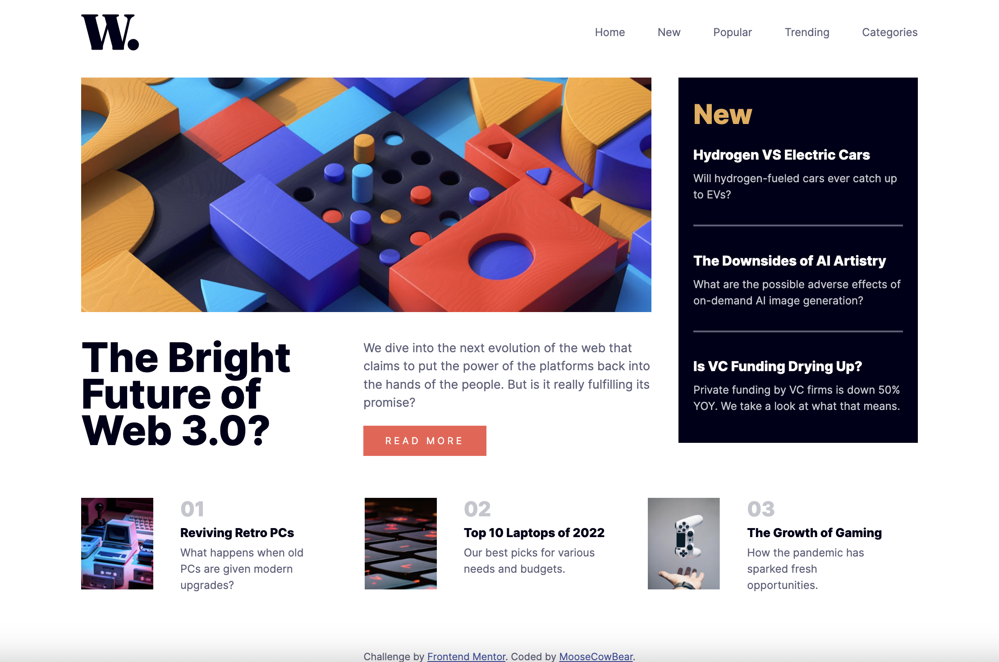

# Frontend Mentor - News homepage solution

This is a solution to the [News homepage challenge on Frontend Mentor](https://www.frontendmentor.io/challenges/news-homepage-H6SWTa1MFl).

## The challenge

Users should be able to:

- View the optimal layout for the interface depending on their device's screen size
- See hover and focus states for all interactive elements on the page

## Screenshot

## Links

- [Solution](https://github.com/MooseCowBear/frontend-mentor-news-homepage)
- [Live](https://moosecowbear.github.io/frontend-mentor-news-homepage/)

## Built with

- Semantic HTML5 markup
- CSS custom properties
- Flexbox
- CSS Grid

## Author

- GitHub - [MooseCowBear](https://github.com/MooseCowBear)
- Frontend Mentor - [@MooseCowBear](https://www.frontendmentor.io/profile/MooseCowBear)